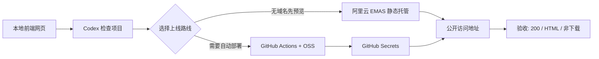

# Aliyun Static Site Deploy Skill

把一个前端静态网页交给 Codex，让它检查项目、生成部署配置、引导填写密钥，并把网站发布到阿里云的无域名访问地址。

这个仓库适合公开给更多人看：进来以后先看 README，就能知道这个 Skill 是干什么的、怎么安装、怎么使用、哪些步骤需要自己操作，以及上线失败时怎么排查。

## 适合解决的问题

很多人已经可以用 Codex 做出一个 HTML 官网，但会卡在上线阶段：

- 没有域名，不知道先用什么方式给客户看。
- 不知道 EMAS 和 OSS 怎么选。
- 不会把本地网页代码推到 GitHub。
- 不知道 GitHub Secrets 应该填什么。
- 不知道 AccessKey Secret 为什么不能发给聊天窗口。
- 页面上线后变成下载 HTML，或者出现阿里云 XML 错误。
- 视频、图片、二维码本地正常，线上却打不开。

这个 Skill 把这些动作做成一套流程，让 Codex 先判断路线，再自动生成能自动化的部分，遇到登录、付款、密钥时停下来让使用者自己确认。

## 工作流总览



## 先看结论

| 场景 | 推荐路线 | 说明 |
|-|-|-|
| 没有域名，只想先给客户看 | EMAS 静态网站托管 | 有阿里云默认访问地址，更适合小白预览 |
| 想以后 push 后自动更新 | OSS + GitHub Actions | 更适合自动化，但必须验收不是下载 HTML |
| 已经有 OSS Bucket 和 AccessKey | OSS workflow | Skill 可以生成 workflow 并协助验收 |
| 还没登录阿里云或涉及付款 | 人工确认 | Skill 会暂停，不能代替你扫码、实名、付款 |

## 一分钟安装

下载仓库里的 Skill 压缩包：

```bash
curl -L -o aliyun-static-site-deploy-skill.zip \
  https://github.com/784697524-ux/aliyun-static-site-deploy-skill/raw/main/release/aliyun-static-site-deploy-skill.zip
```

解压并放到 Codex Skills 目录：

```bash
unzip aliyun-static-site-deploy-skill.zip
mkdir -p ~/.codex/skills
cp -R aliyun-static-site-deploy ~/.codex/skills/
```

重新打开 Codex 后，在你的前端项目目录里说：

```text
使用 $aliyun-static-site-deploy 帮我把当前前端网页上线到阿里云无域名地址。
请先检查项目，再告诉我该走 EMAS 还是 OSS。
需要我登录、付款、填 Secret 的地方请暂停并告诉我怎么填。
能自动完成的 GitHub workflow、推送、验收请继续执行。
```

## Skill 会自动做什么

- 检查当前目录是否适合静态部署。
- 识别 `index.html`、构建脚本、Git 仓库和 GitHub remote。
- 提醒本地大视频不要直接提交到 GitHub。
- 判断先走 EMAS 预览，还是走 OSS 自动部署。
- 生成 OSS 版 GitHub Actions workflow。
- 引导使用者创建 GitHub Secrets。
- 上线后验证 URL 是否真的是网页。
- 对 XML 错误、下载 HTML、权限不足、视频打不开给出排查方向。

核心脚本：

```bash
python3 ~/.codex/skills/aliyun-static-site-deploy/scripts/check_readiness.py --project .
python3 ~/.codex/skills/aliyun-static-site-deploy/scripts/prepare_oss_workflow.py --project . --force
python3 ~/.codex/skills/aliyun-static-site-deploy/scripts/verify_deployed_url.py "$ALIYUN_SITE_URL"
```

## 人工边界

出于账号安全和资金安全，下面这些动作不会由 Skill 自动完成：

| 人工动作 | 为什么必须自己做 |
|-|-|
| 阿里云登录 / 扫码 | 账号身份确认 |
| 实名认证 | 云服务合规要求 |
| 付费 / 续费 | 涉及资金确认 |
| 创建 AccessKey | 涉及云账号密钥 |
| 填写 GitHub Secrets | Secret 不应该进入聊天记录 |
| GitHub 二次验证 | 账号安全要求 |

Skill 会在这些步骤停下来，并用截图告诉使用者应该点哪里、填什么。

## 操作截图

### RAM 用户和授权入口


### AccessKey 创建提示


### GitHub Secrets 入口


### 新增 Repository Secret


## GitHub Secrets 应该填什么

走 OSS 自动部署时，需要在 GitHub 仓库里进入：

`Settings -> Secrets and variables -> Actions -> New repository secret`

逐个新增：

| Secret Name | Secret Value |
|-|-|
| `ALIYUN_ACCESS_KEY_ID` | 阿里云 AccessKey ID |
| `ALIYUN_ACCESS_KEY_SECRET` | 阿里云 AccessKey Secret |
| `ALIYUN_OSS_BUCKET` | OSS Bucket 名称 |
| `ALIYUN_OSS_ENDPOINT` | OSS 地域 endpoint，例如 `oss-cn-hangzhou.aliyuncs.com` |
| `ALIYUN_SITE_URL` | 可选，最终访问地址，用于自动验收 |

注意：左边是固定变量名，右边是真实值。不要填反，也不要把真实 Secret 写进 README、issue、聊天记录或代码文件。

## 上线验收标准

部署任务成功不等于上线完成。必须继续确认：

- 最终 URL 返回 HTTP 200。
- 返回内容是 HTML，不是阿里云 XML 错误。
- 浏览器直接显示网页，不下载 HTML 文件。
- 首屏能看到标题、主要按钮和联系方式。
- 图片、视频、二维码能正常加载。
- 手机端没有文字重叠或横向溢出。

可以让 Skill 自动跑：

```bash
python3 ~/.codex/skills/aliyun-static-site-deploy/scripts/verify_deployed_url.py "你的最终网址"
```

## 常见问题

| 问题 | 可能原因 | 处理方式 |
|-|-|-|
| GitHub push 失败 | 网络、Token、代理问题 | 检查 Token，必要时使用代理或 HTTP/1.1 |
| Actions 报 `secret not found` | Secret 名称拼错 | 回 GitHub Secrets 核对大小写和下划线 |
| OSS 报 `AccessDenied` | RAM 权限不足 | 检查 RAM 用户授权 |
| URL 打开是 XML | 文件未上传到根目录或权限问题 | 检查 `index.html` 和公开访问 |
| HTML 被下载 | OSS 默认域名响应头问题 | 先重跑 workflow，仍失败则用 EMAS 或绑定域名 |
| 视频打不开 | 视频 OSS 权限、欠费或链接问题 | 单独打开视频 URL 验证 |

## 仓库内容

```text
.
├── README.md
├── docs/
│   ├── codex-git-aliyun-tutorial.md
│   ├── codex-git-aliyun-tutorial.xml
│   └── feishu-doc-url.txt
├── release/
│   └── aliyun-static-site-deploy-skill.zip
└── skill/
    └── aliyun-static-site-deploy/
        ├── SKILL.md
        ├── agents/openai.yaml
        ├── references/
        ├── scripts/
        └── assets/screenshots/
```

## 完整教程

- [GitHub 公开版教程](docs/codex-git-aliyun-tutorial.md)
- [飞书 XML 导出版](docs/codex-git-aliyun-tutorial.xml)
- [飞书文档链接](docs/feishu-doc-url.txt)

## 适用边界

适合：

- HTML/CSS/JS 静态官网
- 产品页、活动页、宣传页
- 没有后端接口的静态页面
- 已经有远程图片和视频链接的页面

不适合：

- 需要后端服务、数据库、登录系统的完整 Web 应用
- 需要自动代付费、自动实名认证、自动创建阿里云账号的场景
- 希望把云账号密钥直接交给聊天窗口处理的场景
