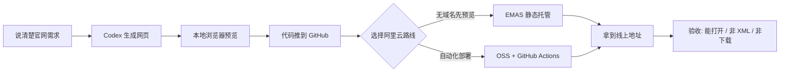
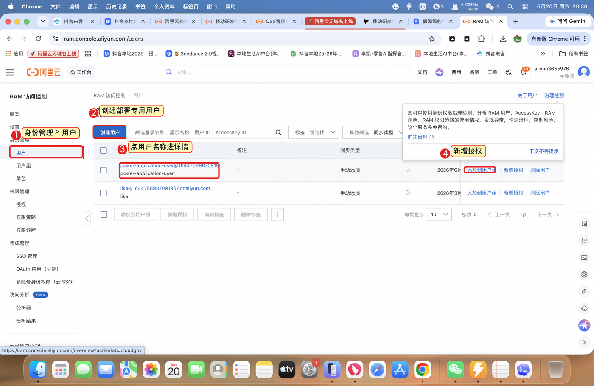
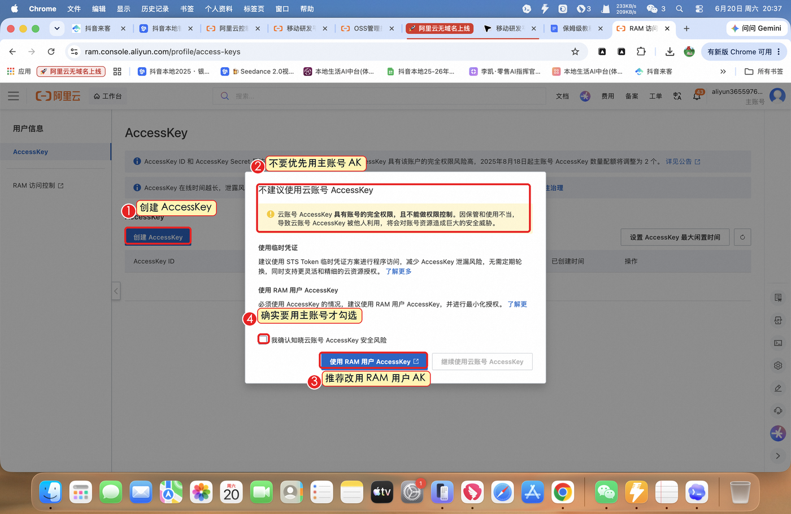
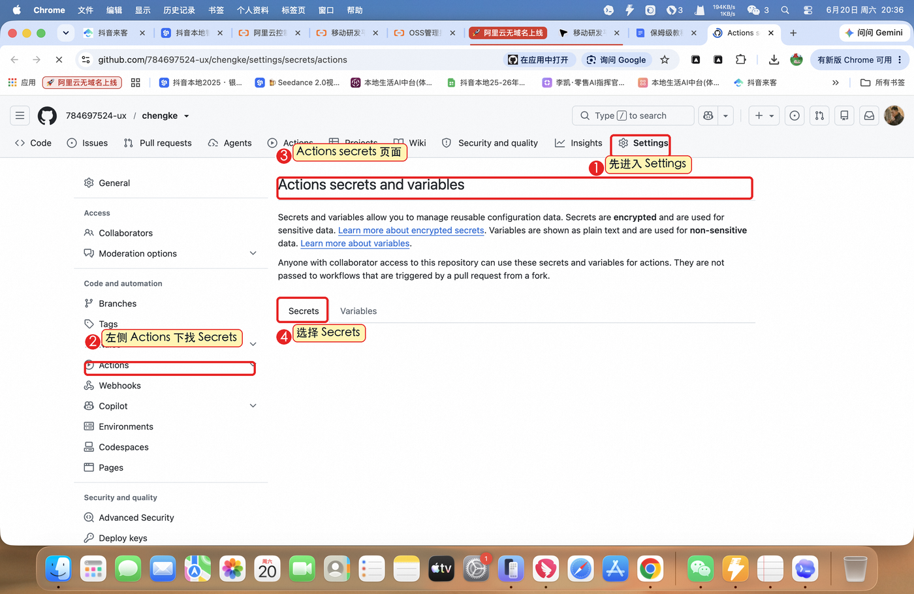
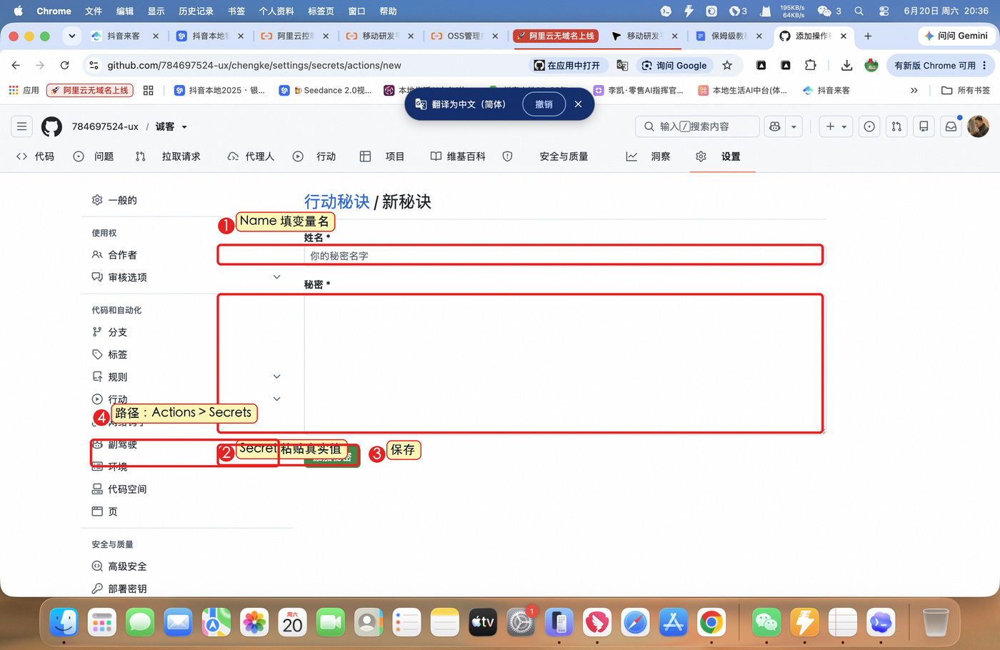

# 保姆级教程：Codex × GitHub × 阿里云无域名上线官网

这篇教程面向没有部署经验的人。目标很简单：让 Codex 帮你把一个前端静态网页，从本地文件夹发布成一个可以访问的阿里云线上地址。

如果你只想快速使用 Skill，先看仓库首页：[README](../README.md)。

## 1. 先理解整件事

上线官网不是一个动作，而是一条流水线。



| 工具 | 大白话解释 | 负责什么 |
|-|-|-|
| Codex | 会写代码的开发同事 | 写官网、改页面、生成部署配置、排错 |
| GitHub | 代码仓库 | 保存官网文件，触发自动部署 |
| 阿里云 EMAS | 静态网站托管空间 | 没有域名时，先生成可访问地址 |
| 阿里云 OSS | 对象存储 | 配合 GitHub Actions 做自动上传 |
| GitHub Secrets | 密钥保险箱 | 保存阿里云密钥，不把 Secret 写进代码 |

## 2. 先选路线

| 路线 | 适合场景 | 优点 | 风险 |
|-|-|-|-|
| EMAS 静态网站托管 | 没有域名，只想先给客户看 | 有阿里云默认地址，适合预览 | 控制台可能需要手动上传 |
| OSS + GitHub Actions | 想以后 push 后自动更新 | 可自动化 | OSS 默认域名可能下载 HTML，必须验收 |

推荐顺序：

1. 小白第一次上线，先用 EMAS 跑通无域名访问。
2. 要反复更新，再接 GitHub Actions + OSS。
3. 上线后一定验收最终 URL，不要只看 Actions 是否成功。

## 3. 开始前准备 4 样东西

| 准备项 | 要确认什么 | 卡住时怎么办 |
|-|-|-|
| Codex 可用 | 能读写你的官网文件夹 | 先让 Codex 改一个小文字测试 |
| GitHub 账号 | 能创建仓库，能 push 代码 | 密码不能 push 时，用 GitHub Token |
| 阿里云账号 | 能进入控制台，必要时已实名 | 看到付款页先确认金额 |
| 官网文件夹 | 有 HTML、CSS、JS、图片和远程视频链接 | 大视频不要直接提交 GitHub |

安全规则：

- 不要把 `AccessKey Secret` 发到聊天里。
- 不要把 GitHub Token 写进文档或代码。
- 不要把密钥截图发给别人。
- 密钥只放 GitHub Secrets。

## 4. 让 Codex 先做出官网

你可以把下面这段复制给 Codex：

```text
请帮我做一个官网，主题是【产品名称】。
目标客户是【客户类型】。
页面需要包含：首屏、痛点、能力模块、工作流、案例证明、价格方案、FAQ、联系方式。
要求：看起来像真实对外销售页，不要像后台系统；手机端不能重叠；视频和二维码要能正常显示。
做完后请告诉我本地怎么预览，并检查页面是否能打开。
```

本地预览：

```bash
cd 你的官网文件夹
python3 -m http.server 8010
```

浏览器打开：

```text
http://127.0.0.1:8010
```

上线前先检查：

- [ ] 首屏 3 秒内能看懂卖什么。
- [ ] 手机端不重叠、不横向溢出。
- [ ] 图片、视频、二维码能显示。
- [ ] 获取方案、预约演示等按钮能点击。

## 5. 把官网代码放到 GitHub

```bash
cd 你的官网文件夹
git init
git add .
git commit -m "Initial website"
git branch -M main
git remote add origin https://github.com/你的用户名/你的仓库名.git
git push -u origin main
```

如果 GitHub 让你输入密码：用户名填 GitHub 用户名，密码位置填 GitHub Token，不是登录密码。

网络不稳定时可以让 Codex 使用：

```bash
git -c http.proxy=http://127.0.0.1:7890 \
    -c https.proxy=http://127.0.0.1:7890 \
    -c http.version=HTTP/1.1 \
    push -u origin main
```

## 6. EMAS 路线：没有域名先拿预览地址

适合：你还没有域名，只想先让客户能打开网页。

步骤：

1. 登录阿里云控制台。
2. 进入 EMAS / 移动研发平台。
3. 创建或选择 Serverless 服务空间。
4. 打开静态网站托管。
5. 上传 `index.html`、JS、CSS、图片等静态文件。
6. 复制阿里云默认访问地址。
7. 用浏览器和手机打开验收。

注意：登录、实名、付款必须由使用者自己确认，Skill 不会自动替你点。

## 7. OSS 路线：GitHub Actions 自动部署

适合：你已经有 OSS Bucket，或者希望以后每次 `git push` 后自动更新网站。

Skill 可以生成 workflow：

```bash
python3 ~/.codex/skills/aliyun-static-site-deploy/scripts/prepare_oss_workflow.py --project . --force
```

生成后会出现类似：

```text
.github/workflows/deploy-aliyun-static-site.yml
```

这个 workflow 会做几件事：

1. 拉取 GitHub 仓库代码。
2. 收集静态网站文件。
3. 下载并配置阿里云 `ossutil`。
4. 上传文件到 OSS Bucket。
5. 设置 HTML、JS、CSS、图片等资源的响应头。
6. 如果配置了 `ALIYUN_SITE_URL`，自动验收最终 URL。

## 8. 创建 RAM 用户和 AccessKey

建议不要直接用阿里云主账号 AccessKey。更稳妥的做法是创建一个专门用于部署的 RAM 用户。

### RAM 用户和授权入口



你需要做：

- 创建或选择一个部署专用 RAM 用户。
- 给它上传静态网站文件需要的权限。
- 进入用户详情，准备创建 AccessKey。

### AccessKey 创建提示



你需要记住：

- AccessKey ID 像用户名。
- AccessKey Secret 像密码。
- Secret 通常只完整显示一次。
- 复制后马上填进 GitHub Secrets。
- 不要截图发给别人。

## 9. 填写 GitHub Secrets

打开 GitHub 仓库：

`Settings -> Secrets and variables -> Actions`

### GitHub Secrets 入口



点击 `New repository secret`。

### 新增 Repository Secret



逐个新增：

| Secret Name | Secret Value |
|-|-|
| `ALIYUN_ACCESS_KEY_ID` | 阿里云 AccessKey ID |
| `ALIYUN_ACCESS_KEY_SECRET` | 阿里云 AccessKey Secret |
| `ALIYUN_OSS_BUCKET` | OSS Bucket 名称 |
| `ALIYUN_OSS_ENDPOINT` | OSS 地域 endpoint，例如 `oss-cn-hangzhou.aliyuncs.com` |
| `ALIYUN_SITE_URL` | 可选，最终访问地址，用于自动验收 |

最容易错的地方：

- `Name` 填固定变量名。
- `Secret` 填真实值。
- 大小写和下划线必须一字不差。

## 10. 推送代码并等待部署

```bash
git add .
git commit -m "Update website"
git push origin main
```

然后打开 GitHub 仓库的 `Actions` 页面：

| 状态 | 意思 | 下一步 |
|-|-|-|
| 绿色对勾 | 部署成功 | 打开最终 URL 验收 |
| 红色叉号 | 部署失败 | 点进日志，把错误交给 Codex 排查 |
| 一直排队 | 等待执行 | 稍等或检查 Actions 是否启用 |

## 11. 上线后必须验收

可以用 Skill 的脚本检查：

```bash
python3 ~/.codex/skills/aliyun-static-site-deploy/scripts/verify_deployed_url.py "你的最终网址"
```

通过标准：

| 验收项 | 通过标准 |
|-|-|
| HTTP 状态 | 返回 200，或跳转后 200 |
| 页面类型 | 返回 HTML，不是 XML 错误 |
| 打开方式 | 浏览器直接显示网页，不下载 HTML |
| 首屏 | 品牌名、产品价值、按钮可见 |
| 资源 | 图片、视频、二维码能加载 |
| 手机端 | 不重叠、不横向溢出 |

## 12. 常见问题排查

| 卡在哪一步 | 表现 | 先查什么 |
|-|-|-|
| GitHub push | SSL、HTTP2、Token 报错 | 网络代理、用户名、Token 权限 |
| 阿里云开通 | UserDisable 或要求付款 | 账号是否欠费，服务是否已开通 |
| GitHub Actions | `secret not found` | Secret Name 是否一字不差 |
| OSS 上传 | `AccessDenied` 或 `NoSuchBucket` | RAM 权限、Bucket 名称、Endpoint |
| 最终 URL | XML 错误 | 文件是否上传到根目录，是否有 `index.html` |
| 最终 URL | 打开变下载 | `Content-Disposition`，必要时换 EMAS |
| 视频 | 黑屏或 XML 报错 | 视频链接是否有效，OSS 是否续费和公开 |

给非技术用户解释错误时，用这个格式：

```text
现在卡在：【一句话说明位置】
不是页面内容问题，而是：【账号 / 权限 / 网络 / 上传 / URL 问题】
你需要做：【用户必须亲自做的一步】
我继续做：【用户完成后 Codex 要做的下一步】
```

## 13. 小白检查清单

- [ ] 已经让 Codex 做出官网初版。
- [ ] 已经本地预览并改到满意。
- [ ] 已经确认图片、视频、二维码能正常显示。
- [ ] 已经把官网代码推到 GitHub。
- [ ] 已经选择路线：EMAS 无域名预览 / OSS 自动部署。
- [ ] 如果走 EMAS，已经进入静态网站托管并上传文件。
- [ ] 如果走 OSS，已经创建 RAM 用户和 AccessKey。
- [ ] 如果走 OSS，已经在 GitHub Secrets 填好所有变量。
- [ ] 已经完成部署并拿到最终 URL。
- [ ] 已经用电脑和手机打开最终 URL。
- [ ] 已经确认页面不是下载文件，也不是 XML 报错。

## 14. 让 Codex 直接执行的提示词

```text
请使用 $aliyun-static-site-deploy 处理当前官网上线：
1. 先检查项目是否适合静态部署。
2. 明确告诉我应该走 EMAS 还是 OSS。
3. 需要我登录、付款、填 Secret 的地方暂停并说明。
4. 能自动完成的 Git、workflow、验收请你继续执行。
5. 最后验证线上地址是否直接打开网页。
```

## 15. 相关文件

- Skill 源文件：[SKILL.md](../skill/aliyun-static-site-deploy/SKILL.md)
- 密钥交接说明：[secrets-hand-off.md](../skill/aliyun-static-site-deploy/references/secrets-hand-off.md)
- 排错说明：[troubleshooting.md](../skill/aliyun-static-site-deploy/references/troubleshooting.md)
- Skill 压缩包：[aliyun-static-site-deploy-skill.zip](../release/aliyun-static-site-deploy-skill.zip)
